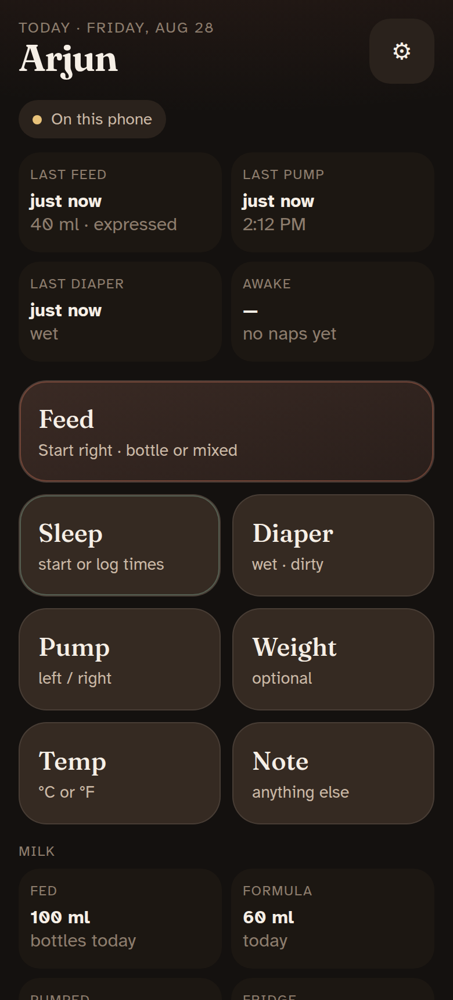
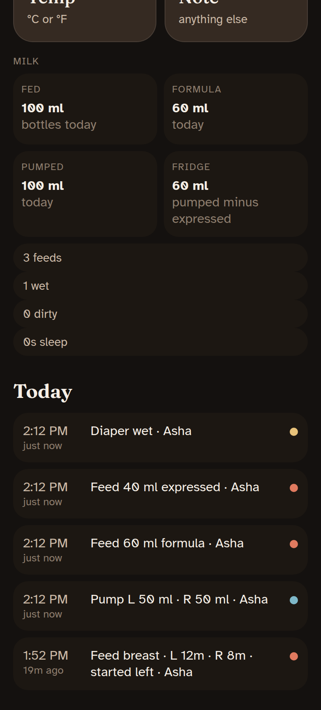
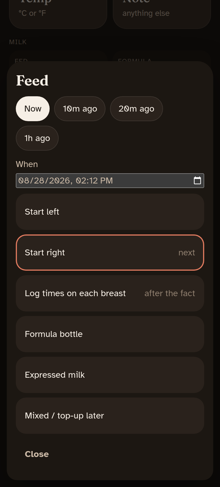
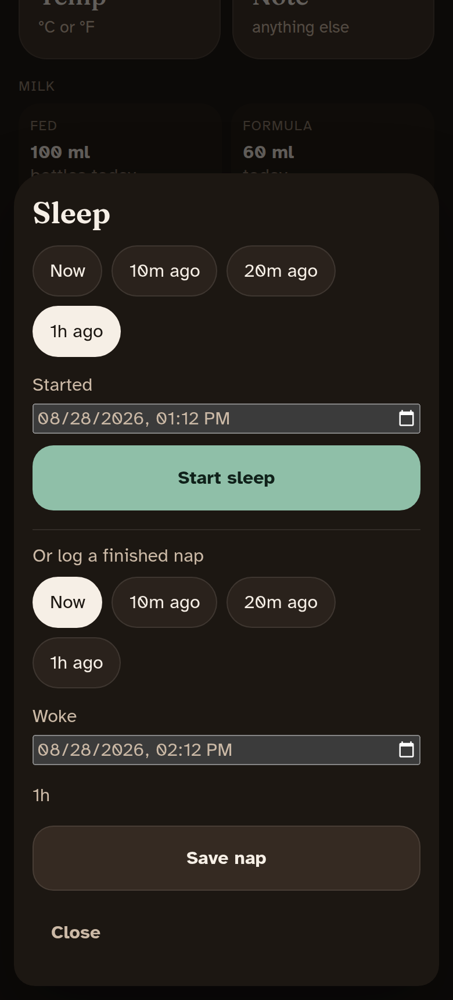

# Baby Day

A night-first PWA for two parents. Log a care event in a few taps. The other parent can see it. The home screen answers “what happened?” and “what needs attention?”

It is a shared handover layer, not a medical or coaching product. No account is required.

The app is **local-first**. Care events stay on the phone unless you turn on sharing. See [privacy.md](docs/privacy.md).

## Screenshots

<table>
  <tr>
    <td align="center">
      
      <br /><sub>Home — last feed, pump, diaper, and awake</sub>
    </td>
    <td align="center">
      
      <br /><sub>Milk today, plus the timeline</sub>
    </td>
  </tr>
  <tr>
    <td align="center">
      
      <br /><sub>Feed — timer, breast times, or a bottle</sub>
    </td>
    <td align="center">
      
      <br /><sub>Sleep — live timer or start and wake times</sub>
    </td>
  </tr>
</table>

## What you can log

| Action | What you record |
| --- | --- |
| **Feed** | Live left/right timer, minutes on each breast after the fact, formula, expressed milk, or mixed |
| **Pump** | Left and right volume |
| **Diaper** | Wet, dirty, or both |
| **Sleep** | Start a timer, or log a finished nap with started and woke times |
| **Temp** | Temperature in °C or °F |
| **Weight** | Optional check-in |
| **Vitamin D / K** | Time given today. Cards are red until logged, green after. |
| **Note** | Anything else |

Every sheet has **Now / 10m / 20m / 1h** chips and a date-and-time picker, so you can log the real clock time.

The home glance shows last feed, last pump, last diaper, and time awake. **Vitamin D** and **Vitamin K** sit under that: red if not given this care day, green with the clock time once they are. Tap a red card to log now; tap a green card to change the time or undo. A **Milk** card splits:

- **Fed** — formula + expressed bottles today (nursing is a feed count, not millilitres)
- **Formula** — formula given today
- **Pumped** — pump sessions today
- **Fridge** — estimate of leftover expressed milk: all pumped minus all expressed bottles, not only today. Spills and milk given away are not tracked.

The care day starts at 5:00 local (configurable), not midnight. Units are ml/oz, kg/lb, and °C/°F.

## Use it

1. Enter the baby’s name and your name.
2. **Feed → Start left/right** starts a timer. Switch side, then end. **Log times on each breast** is for a feed that already happened. Bottles are on the same sheet.
3. **Sleep** opens a sheet: start now, or save a nap with started and woke times. If a sleep timer is already running, the home button ends it.
4. **Pump**, **Diaper**, **Temp**, **Weight**, and **Note** are one sheet each. **Vitamin D** and **Vitamin K** are the red/green cards: tap red to log now, tap green to edit.
5. Tap a timeline row to edit time, breast minutes, notes, or delete (with undo).
6. Settings: units, care-day start hour, 48-hour copy for the pediatrician, JSON/CSV backup. **This Wi-Fi** links the other parent’s phone on the home network with a 6-digit passkey — events stay on the two phones. QR codes remain as a fallback.
7. iOS: Share → Add to Home Screen. Android: Install app.

Names stay on the phone so the timeline can say who logged what.

## Sharing and privacy

Default: everything is on **this phone** (IndexedDB). Nothing is uploaded.

**This Wi-Fi** (Settings) copies events to the other phone over the local network only. One parent shows a 6-digit passkey, the other types it. Both apps must be open on the same network. Link again when you are both home to catch up.

Optional cloud sync exists but stores events in a form the host can read. **Do not turn it on for real baby data** until on-device encryption exists.

## Run locally

Node 22. From the repo:

```bash
npm install
npm run dev
```

Open the URL Vite prints, preferably from your phone on the same network, or Chrome device emulation.

```bash
npm test
npm run build
```

## Deploy

The PWA is a static site. GitHub Actions publishes `dist/` to GitHub Pages on push to `main`.

1. In the repo: **Settings → Pages → GitHub Actions**.
2. Leave Supabase secrets empty if you want care events to stay on the phone.

A custom domain is nicer for PWA install than `username.github.io/baby-day/`. The Vite `base` is `./` so both work.

## Documents

- [Privacy](docs/privacy.md) — what stays on the phone, and what sharing actually does
- [Current product plan](docs/product-plan.md)
- [Hosting and backend](docs/hosting-and-backend.md)
- [Original idea](docs/idea-and-plan.md)
- [Plan review](docs/plan-review.md)
