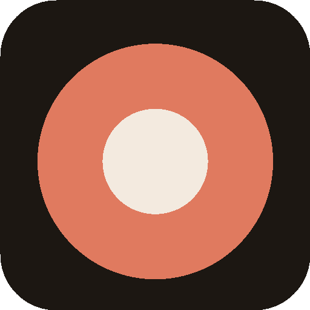

<div align="center">
  
  <h1>Baby Day</h1>
  <p><strong>Night-first care log for two parents.</strong></p>
  <p>Log a feed, sleep, or diaper in a few taps.<br>The home screen answers “what happened?” and “what needs attention?”</p>
  <p>
    <a href="https://pkp124.github.io/baby-day/"></a>
    <a href="https://pkp124.github.io/baby-day/guide/"></a>
  </p>
  <p>
    
    
    
    
  </p>
  <br>
  
</div>

<br>

A shared **handover** layer — not a medical app, not a coach, and not a cloud baby tracker.

**[Open the app](https://pkp124.github.io/baby-day/)** · **[User guide](https://pkp124.github.io/baby-day/guide/)** · **[Privacy](docs/privacy.md)** · **[Technical notes](https://pkp124.github.io/baby-day/tech/)**

## Features

- **Local-first** — events live in IndexedDB on this phone. Nothing is uploaded unless you turn sharing on.
- **Two parents, same Wi-Fi** — pair once with a 6-digit passkey, then tap **Sync** for a day or a week.
- **Built for 3am** — large taps, live feed/sleep timers, backdate chips (Now / 10m / 20m / 1h), undo.
- **Handover glance** — last feed, last pump, last diaper, time awake, milk totals, vitamin D/K.
- **72-hour report** — sleep, milk, diapers, and a printable HTML/PDF for a clinic visit.
- **Optional crib window** — spare phone upstairs, Watch downstairs. Live on the LAN. Nothing recorded.
- **No account** — install from the browser. Names stay on the phone so the timeline can say who logged what.

Care day starts at **5:00 local** (configurable), not midnight. Units: ml/oz, kg/lb, °C/°F.

## Get started

1. Open **[the app](https://pkp124.github.io/baby-day/)** on the phone you will actually use at night.
2. **iPhone:** Safari → Share → Add to Home Screen. **Android:** Install app.
3. Enter the baby’s name and yours. Log the next real event — undo is on the toast if you miss-tap.

The dock is **Home · Report · Camera · Settings**. The home-screen icon is the real app (no browser refresh bar). If it looks stuck: Settings → Reload. A banner appears when a new version is waiting.

Full walkthrough: **[user guide](https://pkp124.github.io/baby-day/guide/)** (also in the app: Settings → User guide).

## Screenshots

<table>
  <tr>
    <td align="center">
      
      <br><sub>Milk + timeline</sub>
    </td>
    <td align="center">
      
      <br><sub>Feed</sub>
    </td>
    <td align="center">
      
      <br><sub>Sleep</sub>
    </td>
  </tr>
</table>

## What you can log

| Action | What you record |
| --- | --- |
| **Feed** | Live left/right timer, minutes after the fact, formula, expressed, or mixed |
| **Sleep** | Start a timer, or log a finished nap |
| **Diaper** | Wet, dirty, or both |
| **Pump** | Left and right volume |
| **Temp / weight** | Optional check-ins |
| **Vitamin D / K** | Red until given this care day, green after |
| **Note** | Anything else |

Tap a timeline row to edit or delete. Nursing is a feed count; millilitres are for bottles. Fridge milk is pumped minus expressed bottles (not only today).

## Two phones

Settings → **This Wi-Fi**. One parent shows a 6-digit passkey, the other types it. Both apps stay open on the same home network. Logs copy phone-to-phone.

After that, tap **Sync** — the code is remembered for a day or a week. Locking a phone drops the live link; already-copied events stay. Guest Wi-Fi with client isolation will fail.

There is still no catch-up while the other phone is off the network. Optional cloud sync exists but is **plaintext — leave it off** for real baby data.

## Crib camera

**Camera** tab on a spare phone upstairs → Use this phone as crib (plugged in, Auto-Lock Never). Downstairs → Watch the crib. Same Wi-Fi reaches another floor. Camera off until someone watches. A phone has no night vision — use a dim night light.

[Guide](https://pkp124.github.io/baby-day/guide/#camera) · [How the video path works](docs/video-monitor.md)

## Docs

- [User guide](https://pkp124.github.io/baby-day/guide/) · [in the app](https://pkp124.github.io/baby-day/#/guide) · [source](docs/user-guide.md)
- [Technical notes](https://pkp124.github.io/baby-day/tech/) · [in the app](https://pkp124.github.io/baby-day/#/tech) · [source](docs/technical.md)
- [Privacy](docs/privacy.md)
- [Hosting](docs/hosting-and-backend.md) · [Product plan](docs/product-plan.md)

## Support

Baby Day is free. No account, no ads, nobody selling baby logs.

If it helped a night: [star the repo](https://github.com/pkp124/baby-day) or [open an issue](https://github.com/pkp124/baby-day/issues).

<!-- Buy Me a Coffee: uncomment and set YOUR_PAGE
[](https://www.buymeacoffee.com/YOUR_PAGE)
Also set custom: in .github/FUNDING.yml
-->

## Develop

Node 22. MIT licensed.

```bash
npm install
npm test
npm run dev
```

Open the Vite URL from a phone on the same network, or Chrome device emulation. Local docs: `/guide/` and `/tech/`.

GitHub Actions publishes `dist/` to [GitHub Pages](https://pkp124.github.io/baby-day/) on push to `main`. Leave Supabase secrets empty so events stay on the phone. Vite `base` is `./`, so a project site or a custom domain both work — a custom domain is nicer for Add to Home Screen.
